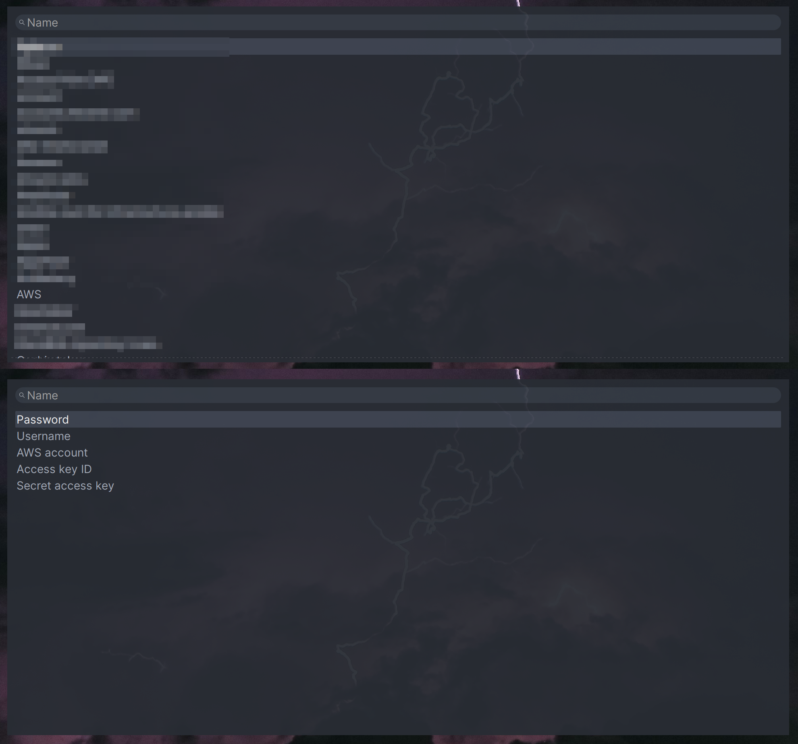
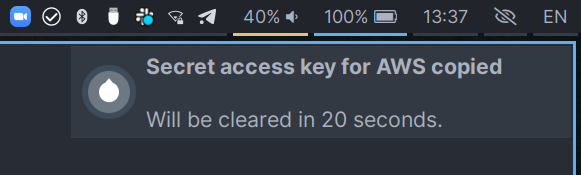

# Bitwarden dmenu Menu

This is a fork of `bitwarden-rofi` project.

The first idea is to provide selector-agnostic solution for those who want to use
bitwarden with other dmenu-compatible applications, like wofi or dmenu itself.

The second one is to allow user to copy not only user/password/totp fields, but
also any custom field.

On selecting an entry, next dmenu with field names is showing up.
On selecting a field, it is copied to your clipboard for 5 seconds.
During those 5 seconds, a notification is shown indicating which field you
are copying at that time.



## Usage

You can either execute the script from a terminal or by binding it to a key
combination in your window manager.

For more info please user `--help` flag with `bwmenu`

## Extra features

Instead of hotkeys this fork provides flag based UX to get rid of Rofi
"vendor-lock". There is extra flags `-u -p -t` to copy username, password or
totp. If you provide one of this flags the second menu will not showed up and
selected field will be copied instead.

### Custom notification icon

You can use `-i` flag to provide custom icon for notifications. F.e. `bwmenu -i ~/.local/share/icons/Qogir/scalable/apps/bitwarden.svg`



## Install

### Via Nix package manager

Import it as flake and use default application in your application's list.

### Via source

Install these **required** dependencies:

- rofi/wofi/dmenu/fuzzel or whatever you want
- bitwarden-cli
- jq

> **Gentoo Users**: It appears Gentoo and some other systems does not provide a kernel with `keyctl`. If so, make sure to install this as well

**Optionally** install these requirements:

- xclip, xsel, or wl-clipboard
- xdotool or ydotool
- libnotify to display notifications via `notify-send`

Then download the script file and place it somewhere on your `$PATH` and grant it
the `+x` permission.

```bash
# Install for all users
sudo install -D --mode=755 --group=root --owner=root bwmenu /usr/local/bin/bwmenu

# Install for yourself
mkdir -p ~/.local/bin && \
  cp bwmenu ~/.local/bin/bwmenu && \
  chmod +x ~/.local/bin/bwmenu
```

## Hall of Fame

[](https://sourcerer.io/fame/mattydebie/mattydebie/bitwarden-rofi/links/0)[](https://sourcerer.io/fame/mattydebie/mattydebie/bitwarden-rofi/links/1)[](https://sourcerer.io/fame/mattydebie/mattydebie/bitwarden-rofi/links/2)[](https://sourcerer.io/fame/mattydebie/mattydebie/bitwarden-rofi/links/3)[](https://sourcerer.io/fame/mattydebie/mattydebie/bitwarden-rofi/links/4)[](https://sourcerer.io/fame/mattydebie/mattydebie/bitwarden-rofi/links/5)[](https://sourcerer.io/fame/mattydebie/mattydebie/bitwarden-rofi/links/6)[](https://sourcerer.io/fame/mattydebie/mattydebie/bitwarden-rofi/links/7)

## License

Released under the GNU General Public License, version 3. See `LICENSE` file.

Copyright © 2018-2021

- Anton Plotnikov
- Andreas Backx
- Daniel Prado
- Jonathan Raphaelson.
- Magnus Bergmark
- Matthias De Bie
- Remy Rojas
- Baptiste Pierrat
- Nathan Wallace
- Anton Plotnikov
- Leon Lilje
